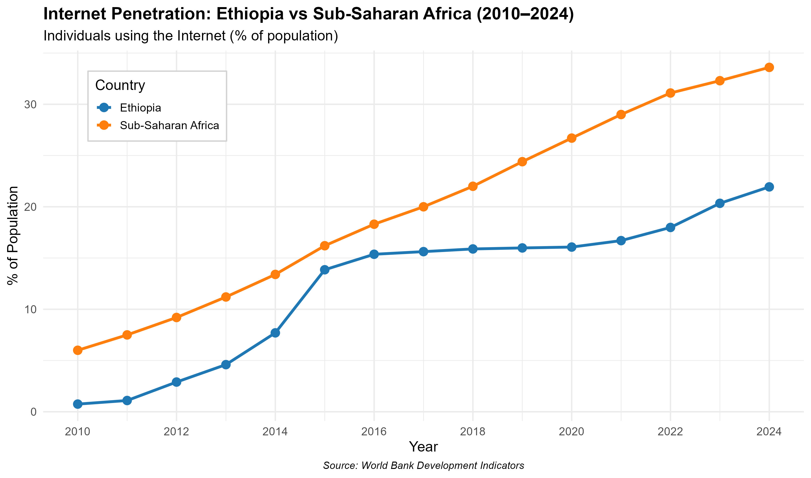

# Architecture of Growth: Ethiopia’s Digital Economy Success Story (2010-2024) #
**Comparative Analysis vs Sub-Saharan Africa using World Bank Data**

  

## Project Overview

This project examines the evolution of Ethiopia’s ICT infrastructure and digital readiness from 2010 to 2024. Using World Bank Development Indicators, it benchmarks Ethiopia’s performance against the Sub-Saharan Africa (SSA) average and analyzes the relationship between digital connectivity (internet penetration and mobile subscriptions) and economic output (GDP per capita).

The analysis supports monitoring progress toward **SDG 9** — Industry, Innovation and Infrastructure.

## Key Findings

- Ethiopia has achieved strong growth in mobile connectivity, reaching over 65 subscriptions per 100 people by 2024.
- Internet penetration has improved significantly since the 2018 telecom reforms but still lags the SSA average (21.9% vs 33.6%).
- Linear regression shows a **strong positive relationship** in Ethiopia: A 1% increase in internet penetration is associated with approximately **$33 higher GDP per capita** (R² = 0.876, p < 0.001).
- The economic multiplier of internet usage is more than double that of basic mobile subscriptions.

## Methodology & Tech Stack

- **Language**: R
- **Key Packages**: `tidyverse` (Data Wrangling), `ggplot2` (Visualization), `broom` (Statistical Modeling), `knitr` (Reporting)
- **Techniques**: Data cleaning, time-series analysis, OLS linear regression, comparative visualization
- **Data Source**: World Bank Open Data (Development Indicators)

## Repository Structure
      ethiopias-digital-readiness-r/
         ├── README.md
         ├── analysis.Rmd    #The master R Markdown file containing all code and narrative
         ├── Architecture_of_Growth.html:       #The final knitted report
         ├── digital_inclusion_raw.csv:    #The  dataset used for the study
         ├── internet_penetration.png      # vizualization1
         └── cellular_subscriptions.png      # vizualization2
              
## How to Reproduce

1. Clone this repository
2. Open `analysis.Rmd` in RStudio
3. Install required packages:
   ```r
   install.packages(c("tidyverse", "ggplot2", "broom", "knitr"))
4. Knit the document

## Future Improvements ##
**Build an interactive Power BI dashboard**


Author: Mathyas Tilahun

Date: April 2026
